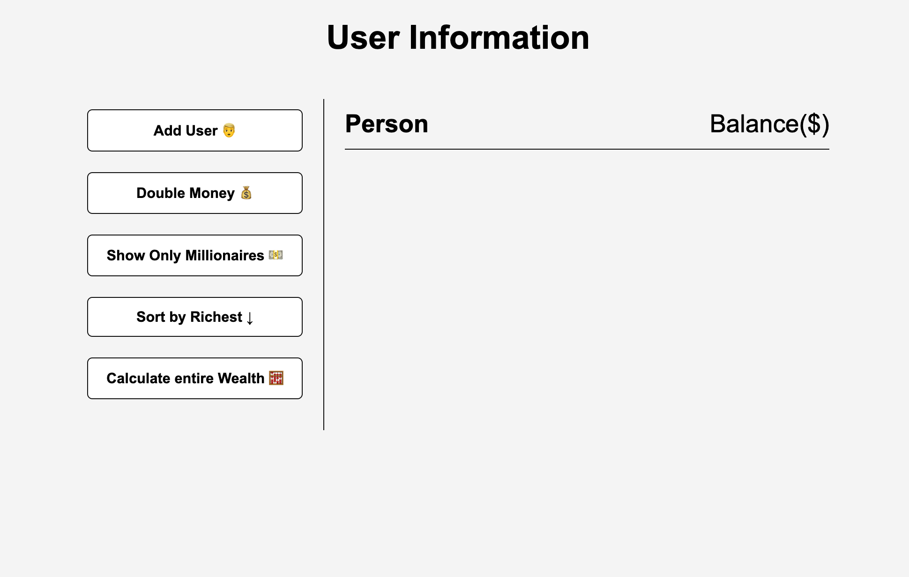
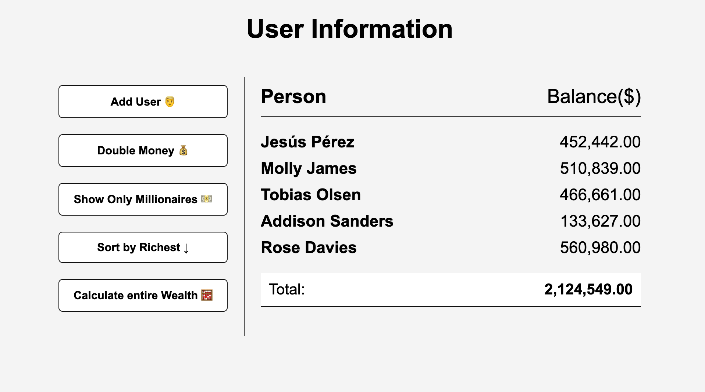

## DOM manipulation

## Requirements

1. Step 1: Get user data using this url: `https://randomuser.me/api/`
2. Step 2: Using JavaScript method to double the money, filter only millionaires, sort by money and to get total money.
3. Step 3: Add the styling in the styles.css file

## Example

